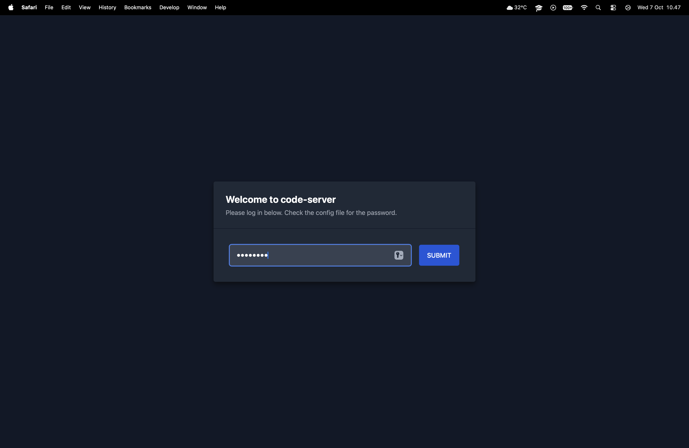
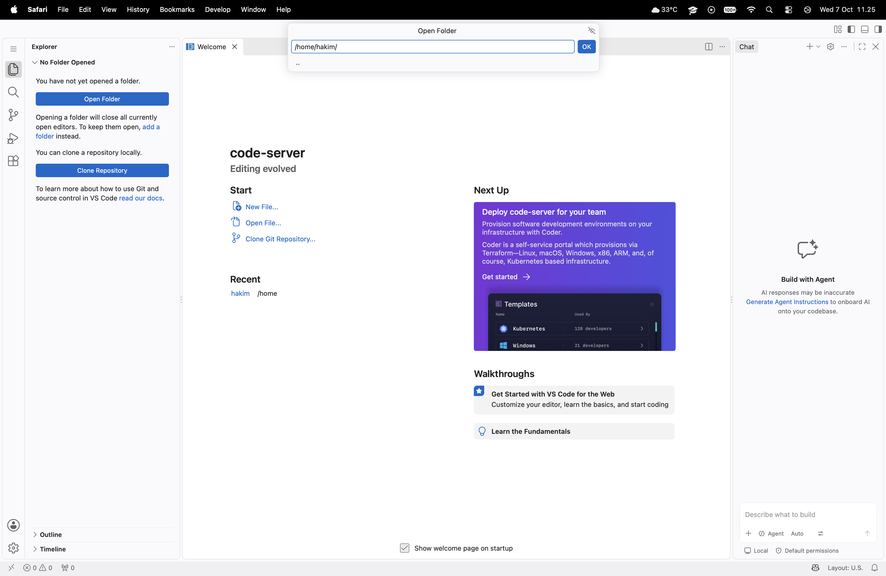
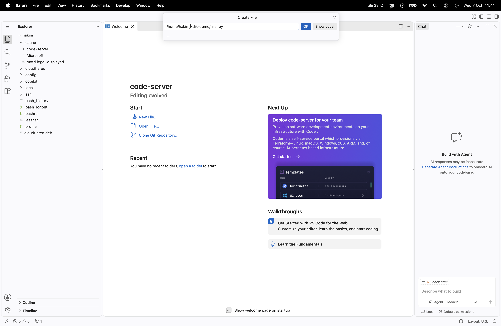
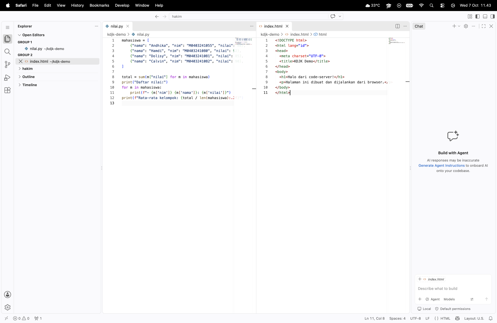
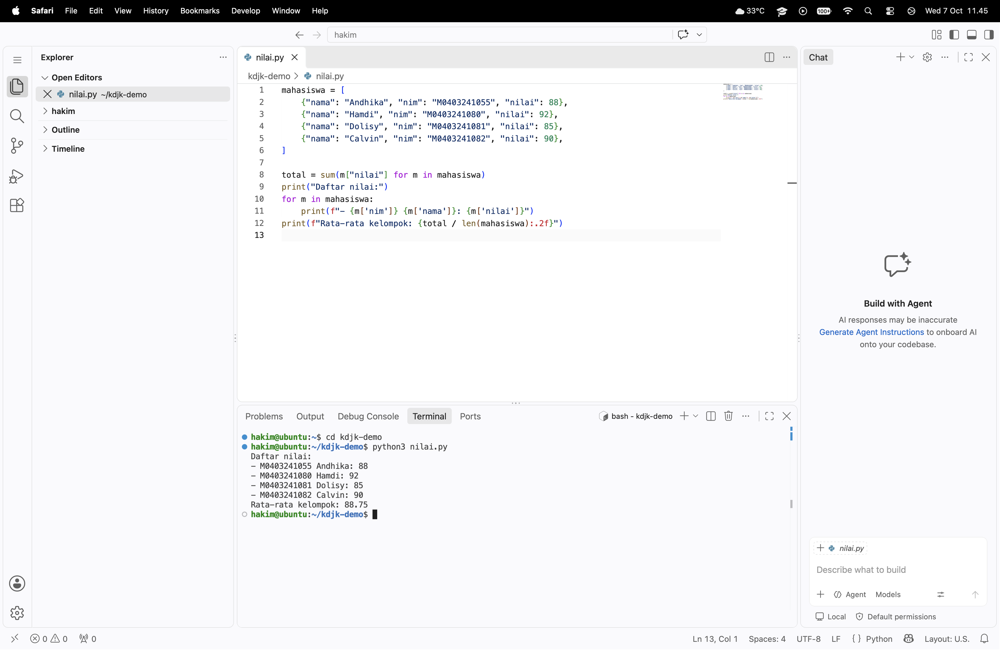
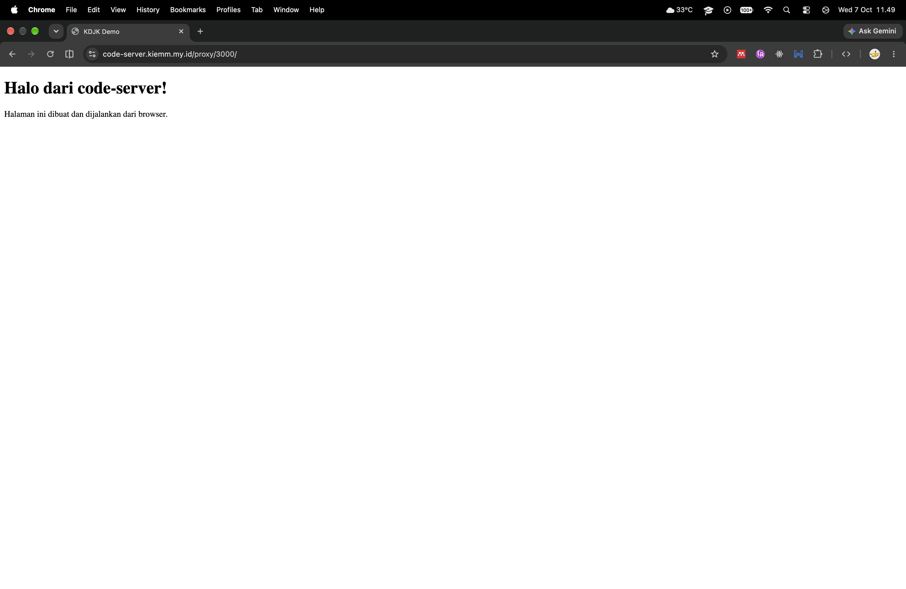
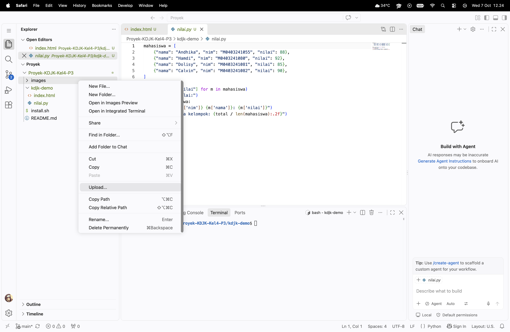
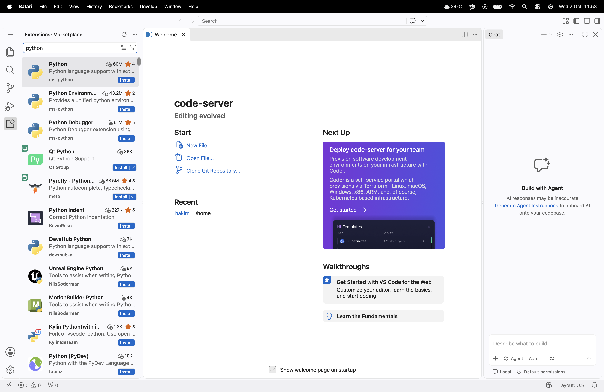
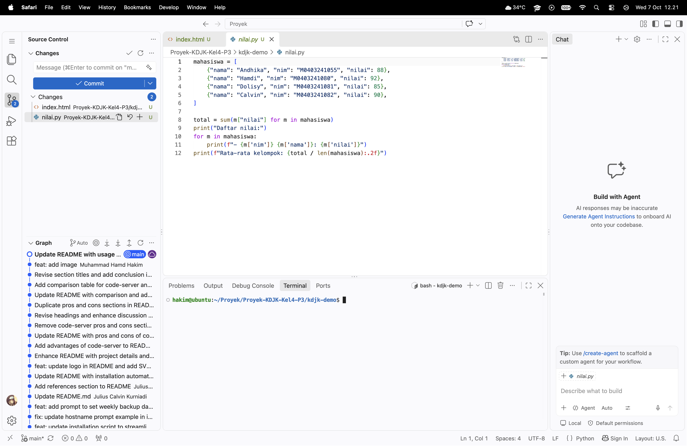
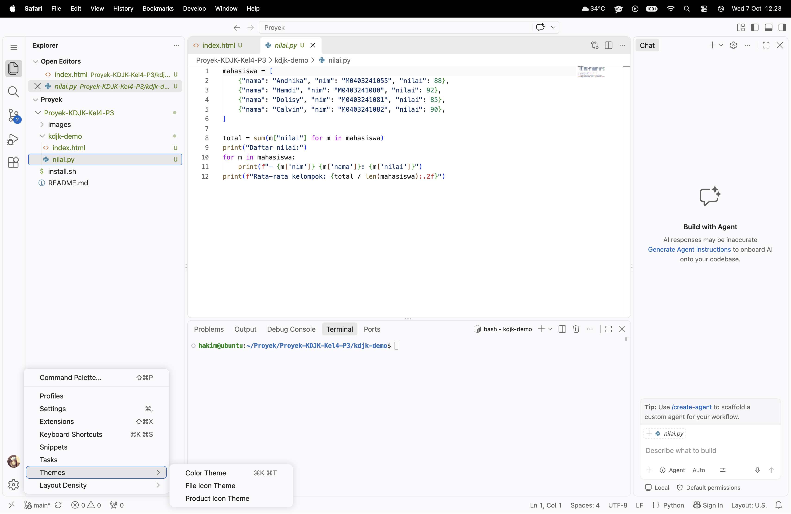

<section align="center">
  
  <div align="center">
    <h1>Aplikasi code-server</h1>
    <p>Disusun oleh: </p>
    <table align="center" style="margin-top: 1rem; text-align: left; border-collapse: collapse;">
      <tr>
        <td style="padding: 4px 12px; font-weight: bold;">Nama</td>
        <td style="padding: 4px 12px;">NIM</td>
      </tr>
      <tr>
        <td style="padding: 4px 12px; font-weight: bold;">M. Andhika Putra Pratama</td>
        <td style="padding: 4px 12px;">M0403241055</td>
      </tr>
      <tr>
        <td style="padding: 4px 12px; font-weight: bold;">Muhammad Hamdi Hakim</td>
        <td style="padding: 4px 12px;">M0403241080</td>
      </tr>
      <tr>
        <td style="padding: 4px 12px; font-weight: bold;">Dolisy Febriani Yurni</td>
        <td style="padding: 4px 12px;">M0403241081</td>
      </tr>
      <tr>
        <td style="padding: 4px 12px; font-weight: bold;">Julius Calvin Kurniadi</td>
        <td style="padding: 4px 12px;">M0403241082</td>
      </tr>
    </table>
  </div>
  <nav aria-label="Navigation">
    <a href="#sekilas-tentang">Sekilas Tentang</a> |
    <a href="#instalasi">Instalasi</a> |
    <a href="#konfigurasi">Konfigurasi</a> |
    <a href="#maintenance">Maintenance</a> |
    <a href="#otomatisasi">Otomatisasi</a> |
    <a href="#cara-pemakaian">Cara Pemakaian</a> |
    <a href="#pembahasan">Pembahasan</a> |
    <a href="#referensi">Referensi</a>
  </nav>
</section>
 
 
## Sekilas Tentang
 
<p><strong><a href="https://github.com/coder/code-server">code-server</a></strong> adalah aplikasi web open source yang menjalankan Visual Studio Code di server, sehingga bisa diakses lewat browser dari perangkat apa pun (laptop, tablet, atau Chromebook) tanpa menginstal VS Code di sisi klien. Proyek ini dikembangkan oleh <strong><a href="https://github.com/coder/">Coder</a></strong>.
Seluruh proses berat seperti kompilasi, menjalankan terminal, dan debugging dijalankan di server, sedangkan browser hanya menampilkan antarmukanya. Karena itu lingkungan pengembangan menjadi seragam dan terpusat. Spesifikasi perangkat klien juga tidak terlalu berpengaruh, selama server cukup kuat.
 
 
## Instalasi
 
### Prasyarat
- Linux atau macOS (64-bit). Pada proyek ini digunakan Ubuntu Server 26.04 LTS.
- Akun pengguna non-root dengan hak `sudo`.
- `curl` terpasang dan koneksi internet aktif.
- Server dengan RAM 1 GB (disarankan 2 GB atau lebih), CPU 2 core.
- Browser (Chrome, Firefox, Edge, atau Safari).
- Domain

Catatan: record domain di-*set* dengan bantuan Cloudflare dan domain akan diarahkan ke Cloudflare Tunnel

### Langkah Instalasi
 
Langkah di bawah berlaku untuk Ubuntu/Debian.
 
1. Perbarui sistem dan pasang `curl`:
```bash
   sudo apt update && sudo apt upgrade -y
   sudo apt install -y curl
```
 
2. Pasang code-server dengan skrip resmi. Di Ubuntu, skrip ini akan memasang paket `.deb`:
```bash
   curl -fsSL https://code-server.dev/install.sh | sh
```
 
3. Periksa hasil instalasi:
```bash
   code-server --version
```
 
4. Aktifkan code-server sebagai layanan agar berjalan otomatis:
```bash
   sudo systemctl enable --now code-server@$USER
```
 
5. Atur `~/.config/code-server/config.yaml`. **code-server** cukup mendengarkan di `127.0.0.1` karena akses dari internet dilewatkan melalui Cloudflare Tunnel yang berjalan di server yang sama:
```yaml
   bind-addr: 127.0.0.1:8080
   auth: password
   password: "<YOUR-PASSWORD>"
   cert: false
```
 
   Restart layanan:
 
```bash
   sudo systemctl restart code-server@$USER
```
 
6. Pasang `cloudflared`:
```bash
   curl -fL -o cloudflared.deb https://github.com/cloudflare/cloudflared/releases/latest/download/cloudflared-linux-amd64.deb
   sudo dpkg -i cloudflared.deb
```
 
7. Login ke Cloudflare. Salin URL yang ditampilkan di terminal dan buka di browser. Lalu pilih domain Anda:
```bash
   cloudflared tunnel login
```
 
8. Buat tunnel dan arahkan subdomain ke tunnel tersebut (ganti `<YOUR-DOMAIN>` dengan hostname Anda):
```bash
   cloudflared tunnel create codeserver
   cloudflared tunnel route dns codeserver <YOUR-DOMAIN>
```
 
9. Siapkan konfigurasi di `/etc/cloudflared/`. Ganti `<ID_TUNNEL>` dengan ID dari langkah sebelumnya. Ganti juga `<YOUR-DOMAIN>`:
```bash
   sudo mkdir -p /etc/cloudflared
   sudo cp ~/.cloudflared/<ID_TUNNEL>.json /etc/cloudflared/
   sudo tee /etc/cloudflared/config.yml > /dev/null <<EOF
   tunnel: <ID_TUNNEL>
   credentials-file: /etc/cloudflared/<ID_TUNNEL>.json
   ingress:
     - hostname: <YOUR-DOMAIN>
       service: http://localhost:8080
     - service: http_status:404
   EOF
```
 
10. Jalankan sebagai layanan agar berjalan otomatis:
```bash
    sudo cloudflared service install
    sudo systemctl status cloudflared
```
 
11. Buka `https://<YOUR-DOMAIN>` dan masukkan password.
Catatan:
- Untuk uji coba tanpa domain, gunakan *Quick Tunnel*: `cloudflared tunnel --url http://localhost:8080`. Cloudflare menampilkan URL sementara `https://xxxx.trycloudflare.com` yang berubah setiap tunnel dijalankan ulang dan berhenti jika terminal ditutup.

## Konfigurasi
 
### Batas memori
 
code-server tidak memiliki pengaturan batas memori sendiri, sehingga batasnya dipasang lewat *systemd*. Ganti `1G` sesuai kebutuhan.
 
```bash
sudo mkdir -p /etc/systemd/system/code-server@$USER.service.d
sudo tee /etc/systemd/system/code-server@$USER.service.d/override.conf > /dev/null <<'EOF'
[Service]
MemoryMax=1G
EOF
```

 
Simpan, lalu terapkan:
 
```bash
sudo systemctl daemon-reload
sudo systemctl restart code-server@$USER
```
Untuk memeriksa apakah perubahan sudah diterapkan, jalankan:
```bash
systemctl show code-server@$USER -p MemoryMax
```

### Ekstensi
 
Plugin pada code-server berupa ekstensi VS Code yang diambil dari registry [Open VSX](https://open-vsx.org), sehingga sebagian ekstensi dari Microsoft Marketplace tidak tersedia. Ekstensi dapat dipasang lewat panel **Extensions** atau CLI:
 
```bash
code-server --install-extension yzhang.markdown-all-in-one
code-server --list-extensions
```
 
## Maintenance
 
code-server tidak menggunakan database. Program code-server dapat dipasang
ulang dengan skrip instalasi, sehingga yang perlu dicadangkan adalah
konfigurasi, ekstensi, dan folder proyek.
 
### Backup konfigurasi, ekstensi, dan proyek (mingguan)
 
Buat skrip `~/backup-code-server.sh` berikut. Ganti nilai `PROJECT_DIR` jika
nama folder proyek di home berbeda:
 
```bash
#!/bin/bash
BACKUP_DIR="$HOME/backup"
PROJECT_DIR="project"
mkdir -p "$BACKUP_DIR"
 
tar -czf "$BACKUP_DIR/code-server-$(date +%F).tar.gz" \
  -C "$HOME" .config/code-server .local/share/code-server "$PROJECT_DIR"
 
# Hapus backup yang lebih lama dari 28 hari.
find "$BACKUP_DIR" -name 'code-server-*.tar.gz' -mtime +28 -delete
```
 
Beri izin eksekusi pada skrip:
 
```bash
chmod +x ~/backup-code-server.sh
```
 
Pastikan folder proyek sudah ada sebelum skrip dijalankan karena `tar` akan
gagal jika folder tersebut tidak ditemukan. Jadwalkan backup setiap Minggu
pukul 02.00 dengan `crontab -e`:
 
```cron
0 2 * * 0 /home/<username>/backup-code-server.sh
```
 
Untuk memulihkan konfigurasi, jalankan kembali skrip instalasi code-server,
lalu ekstrak arsip backup ke home:
 
```bash
tar -xzf code-server-<tanggal>.tar.gz -C ~
```
 
### Pembersihan log (harian)
 
Gunakan `sudo crontab -e` untuk menambahkan pembersihan journal setiap hari
pukul 03.00. Perintah ini menyimpan log selama 14 hari terakhir:
 
```cron
0 3 * * * /usr/bin/journalctl --vacuum-time=14d
```
 
### Pembaruan dan pemantauan
 
Perbarui sistem secara berkala, lalu periksa status layanan dan log
code-server:
 
```bash
sudo apt update && sudo apt upgrade -y
systemctl status code-server@$USER
journalctl -u code-server@$USER -n 50
```
 
Jika muncul pesan *System restart required*, jalankan `sudo reboot`.
**code-server** akan aktif kembali secara otomatis karena layanannya sudah
di-*enable* melalui systemd.

## Otomatisasi
Terdapat cara alternatif yang lebih mudah untuk melakukan instalasi aplikasi, yakni menggunakan script shell yang otomatis akan menjalankan semua perintah instalasi pada terminal. Script shell yang dapat digunakan adalah [install.sh](install.sh)

Cara pemakaian skrip adalah sebagai berikut.
```bash
chmod +x install.sh
./install.sh
```

## Cara Pemakaian
code-server dipakai lewat browser, jadi tidak ada aplikasi yang perlu dipasang di sisi pengguna. Bagian ini menunjukkan alur pemakaian dari login sampai menjalankan proyek sederhana. Contoh data yang dipakai adalah proyek dummy `kdjk-demo` yang berisi daftar nilai mahasiswa.
### 1. Login
1. Buka `https://<YOUR-DOMAIN>` di browser.
2. Masukkan password yang sudah diatur di `~/.config/code-server/config.yaml`, lalu klik **SUBMIT**.
   
3. Setelah berhasil, tampil halaman *Welcome* code-server. Jika lupa password, lihat kembali isi `config.yaml` di server:
```bash
   cat ~/.config/code-server/config.yaml
```
 
### 2. Mengenal Tampilan Aplikasi
Tampilannya mirip dengan VS Code desktop. 

| Bagian | Fungsi |
|---|---|
| **Menu** (ikon ☰ paling atas di kiri) | Berisi menu File, Edit, Selection, View, Go, Run, Terminal, Help, dan **Sign out of code-server** |
| **Activity Bar** (kolom ikon di kiri) | Berpindah antar panel: **Explorer**, **Search**, **Source Control**, **Run and Debug**, dan **Extensions** |
| **Side Bar** | Isi panel yang sedang dipilih. Pada Explorer terdapat tombol **Open Folder** dan **Clone Repository**, serta bagian **Outline** dan **Timeline** di bawahnya |
| **Editor** (tengah) | Tempat menulis dan mengedit file, termasuk halaman *Welcome*. Bisa membuka banyak tab sekaligus |
| **Panel Chat** (kanan) | Panel asisten *Build with Agent*. Panel ini opsional dan bisa ditutup dengan tombol **X** atau disembunyikan lewat ikon layout di kanan atas |
| **Panel** (bawah, muncul saat dibuka) | Terminal, Problems, Output, dan Debug Console |
| **Akun dan Pengaturan** (kiri bawah) | Ikon akun dan ikon ⚙ untuk membuka *Settings* dan tema |
| **Status Bar** (paling bawah) | Jumlah error dan warning, bahasa file, posisi kursor, dan branch Git |

### 3. Fungsi-Fungsi Utama
#### 3.1 Membuka Folder Proyek
 
1. Klik tombol **Open Folder** pada panel Explorer, atau melalui menu ☰ → **File → Open Folder...** (`Ctrl+K Ctrl+O`).
2. Pilih folder `/home/<username>/project`, lalu klik **OK**.
3. Jika muncul pertanyaan *Do you trust the authors of the files in this folder?*, pilih **Yes, I trust the authors**.
   

#### 3.2 Membuat File dan Folder
1. Pada panel **Explorer**, klik ikon **New Folder** lalu beri nama `kdjk-demo`.
2. Klik kanan folder `kdjk-demo`, pilih **New File**, lalu buat dua file berikut.

**`kdjk-demo/nilai.py`**
```python
mahasiswa = [
    {"nama": "Andhika", "nim": "M0403241055", "nilai": 88},
    {"nama": "Hamdi", "nim": "M0403241080", "nilai": 92},
    {"nama": "Dolisy", "nim": "M0403241081", "nilai": 85},
    {"nama": "Calvin", "nim": "M0403241082", "nilai": 90},
]
 
total = sum(m["nilai"] for m in mahasiswa)
print("Daftar nilai:")
for m in mahasiswa:
    print(f"- {m['nim']} {m['nama']}: {m['nilai']}")
print(f"Rata-rata kelompok: {total / len(mahasiswa):.2f}")
```
 
**`kdjk-demo/index.html`**
```html
<!DOCTYPE html>
<html lang="id">
<head>
  <meta charset="UTF-8">
  <title>KDJK Demo</title>
</head>
<body>
  <h1>Halo dari code-server!</h1>
  <p>Halaman ini dibuat dan dijalankan dari browser.</p>
</body>
</html>
```
 


#### 3.3 Menulis dan Mengedit Kode
 
Editor mendukung *syntax highlighting*, *auto-complete*, dan penutupan tanda kurung otomatis. Beberapa fitur yang sering dipakai:
 
- **Command Palette**: tekan `F1` (atau `Ctrl+Shift+P`) untuk mencari semua perintah.
- **Cari di file**: `Ctrl+F`. **Cari di seluruh proyek**: `Ctrl+Shift+F` (ikon Search).
- **Format ulang kode**: `Shift+Alt+F`.
- **Simpan**: `Ctrl+S`.
> Beberapa pintasan seperti `Ctrl+W` atau `Ctrl+N` dipakai oleh browser. Jika bentrok, gunakan Command Palette (`F1`).
 


#### 3.4 Menggunakan Terminal Terintegrasi
 
1. Buka terminal dengan menu ☰ → **Terminal → New Terminal** (atau `` Ctrl+` ``).
2. Jalankan skrip Python contoh:
```bash
   cd ~/project/kdjk-demo
   python3 nilai.py
```
3. Hasil yang muncul:
```
   Daftar nilai:
   - M0403241055 Andhika: 88
   - M0403241080 Hamdi: 92
   - M0403241081 Dolisy: 85
   - M0403241082 Calvin: 90
   Rata-rata kelompok: 88.75
```
 
   
 
Terminal ini berjalan di server, sehingga semua perintah (`apt`, `git`, `python3`, `node`, dan lain-lain) dijalankan di server, bukan di perangkat pengguna.

#### 3.5 Menjalankan Web dan Melihat Hasilnya (Port Proxy)
 
code-server dapat meneruskan port aplikasi yang berjalan di server lewat alamat `/proxy/<port>/`.
 
1. Di terminal, jalankan web server sederhana pada port 3000:
```bash
   cd ~/project/kdjk-demo
   python3 -m http.server 3000
```
2. Buka tab baru di browser dan akses:
```
   https://<YOUR-DOMAIN>/proxy/3000/
```
3. Halaman `index.html` akan tampil. Tekan `Ctrl+C` di terminal untuk menghentikan server.
   
   
#### 3.6 Upload dan Download File
- **Upload**: seret (*drag and drop*) file dari komputer ke panel Explorer. File akan tersimpan di server.
- **Download**: klik kanan file atau folder di Explorer, lalu pilih **Download...**.

 
#### 3.7 Memasang Ekstensi
 
1. Klik ikon **Extensions** pada Activity Bar (atau `Ctrl+Shift+X`).
2. Cari ekstensi, misalnya `Python` atau `Markdown All in One`, lalu klik **Install**.
3. Ekstensi berasal dari registry Open VSX. Jika tidak ditemukan, ekstensi tersebut kemungkinan hanya tersedia di Microsoft Marketplace.

 
#### 3.8 Menggunakan Git (Source Control)
 
1. Pastikan Git terpasang. Jika belum:
```bash
   sudo apt install -y git
   git config --global user.name "Nama Anda"
   git config --global user.email "email@contoh.com"
```
2. Klik ikon **Source Control** pada Activity Bar, lalu klik **Initialize Repository**.
3. Pada daftar *Changes*, klik **+** untuk men-*stage* file, tulis pesan commit (misalnya `Tambah nilai.py dan index.html`), lalu klik **Commit**.

 
#### 3.9 Mengubah Tema dan Pengaturan
 
- Ganti tema warna: `Ctrl+K Ctrl+T`.
- Buka pengaturan: ikon ⚙ di kiri bawah Activity Bar → **Settings**, misalnya untuk mengubah ukuran font atau mengaktifkan *auto save*.

 
### 4. Logout dan Menutup Sesi
 
Klik ikon ☰ → **Sign out of code-server**. Layanan code-server tetap berjalan di server, sehingga proyek dan terminal dapat dibuka kembali kapan saja dengan login ulang.


## Pembahasan
### Pendapat Tentang Aplikasi Web Ini
  1. **Kelebihan**
     - **Dapat diakses melalui browser**. Penggunaan code-server cukup dilakukan dengan membuka browser dan mengakses alamat server, tidak perlu menginstall aplikasinya. Cocok digunakan di berbagai perangkat sehingga mendukung _remote development._
     - **Environment lebih terpusat**. Administrator dapat menyiapkan satu environment development yang digunakan banyak pengguna dengan versi compiler, library, runtime, dan konfigurasi yang lebih konsisten. Hal ini dapat mengurangi masalah _works on my machine_.
     - **Lebih ringan di sisi server**. Klien hanya menjalankan browser sehingga beban komputasi utama berada pada server.
     - **Antarmuka familiar bagi pengguna VS Code**. Code-server mendukung terminal, file explorer, editor, extensions, dan fitur development yang mirip dengan VS Code.
     - **Dapat diintegrasikan dengan server/infrastruktur pribadi**. Code-server dapat dikombinasikan dengan autentikasi, reverse proxy, HTTPS, dan sistem manajemen pengguna.

  2. **Kekurangan**
     - **Membutuhkan Server**. Karena code-server berjalan di server, maka harus tersedia CPU, RAM, storage, dan jaringan yang memadai. Jika server tidak dapat diakses, development juga terganggu. Penggunaan resource juga berada di server.
     - **Keamanan menjadi tanggung jawab administrator**. Jika server terbuka melalui internet, endpoint code-server harus diamankan. Autentikasi, HTTPS, firewall, akses pengguna, dan konfigurasi server perlu diperhatikan. Kesalahan konfigurasi dapat menyebabkan proyek/terminal terekspos.
     - **Pengaturan awal lebih kompleks**. Code-server membutuhkan konfigurasi server, network, authentication, dan biasanya reverse proxy/HTTPS jika digunakan secara serius.
     - **Potensi masalah performa**, seperti latency jaringan, bandwidth, performa server, jumlah pengguna, dan proses yang sedang berjalan di server.
    
### Perbandingan dengan Aplikasi Sejenis
Aplikasi sejenis yang kami gunakan adalah GitHub Codespaces dan Eclipse Theia. Berikut merupakan perbandingannya.

<section align="center">
  <table align="center" style="margin-top: 1rem; text-align: left; border-collapse: collapse;">
      <tr>
        <td style="padding: 4px 12px; font-weight: bold; align: center;">Aspek</td>
        <td style="padding: 4px 12px;">Code-Server</td>
        <td style="padding: 4px 12px;">GitHub Codespaces</td>
        <td style="padding: 4px 12px;">Eclipse Theia</td>
      </tr>
      <tr>
        <td style="padding: 4px 12px; font-weight: bold;">Pengembang</td>
        <td style="padding: 4px 12px;">Coder</td>
        <td style="padding: 4px 12px;">GitHub</td>
        <td style="padding: 4px 12px;">Eclipse Foundation</td>
      </tr>
      <tr>
        <td style="padding: 4px 12px; font-weight: bold;">Konsep utama</td>
        <td style="padding: 4px 12px;">Menyerupai VS Code pada server dengan mengaksesnya melalui browser</td>
        <td style="padding: 4px 12px;">Pengembangan berbasis cloud yang terintegrasi langsung dengan GitHub</td>
        <td style="padding: 4px 12px;">Membangun IDE yang dapat dikustomisasi, terutama untuk web dan cloud</td>
      </tr>
      <tr>
        <td style="padding: 4px 12px; font-weight: bold;">Model deployment</td>
        <td style="padding: 4px 12px;">Self-hosted</td>
        <td style="padding: 4px 12px;">Cloud-hosted</td>
        <td style="padding: 4px 12px;">Self-hosted</td>
      </tr>
      <tr>
        <td style="padding: 4px 12px; font-weight: bold;">Cara penggunaan</td>
        <td style="padding: 4px 12px;">Membuka code-server di browser dan melakukan pengkodean di environment pada server</td>
        <td style="padding: 4px 12px;">Membuat codespace dari repository GitHub, kemudian GitHub menyediakan environment development yang siap digunakan</td>
        <td style="padding: 4px 12px;">Menggunakan Theia sebagai dasar untuk membangun dan menjalankan IDE</td>
      </tr>
      <tr>
        <td style="padding: 4px 12px; font-weight: bold;">Kebutuhan server</td>
        <td style="padding: 4px 12px;">Membutuhkan server yang dapat berupa server lokal, VM, cloud server, atau server organisasi</td>
        <td style="padding: 4px 12px;">Tidak perlu menyediakan server pribadi karena environment sudah disediakan oleh GitHub</td>
        <td style="padding: 4px 12px;">Membutuhkan infrastruktur sendiri jika digunakan secara self-hosted</td>
      </tr>
      <tr>
        <td style="padding: 4px 12px; font-weight: bold;">Kustomisasi</td>
        <td style="padding: 4px 12px;">Dapat dikonfigurasi dan ditambahkan extension</td>
        <td style="padding: 4px 12px;">Dapat dikonfigurasi menggunakan development container dan konfigurasi repository, tetapi pengguna tidak memiliki kontrol penuh terhadap platform Codespaces</td>
        <td style="padding: 4px 12px;">Dapat dikustomisasi karena Theia dirancang sebagai platform untuk membangun IDE dan development environment sendiri</td>
      </tr>
      <tr>
        <td style="padding: 4px 12px; font-weight: bold;">Skalabilitas</td>
        <td style="padding: 4px 12px;">Bergantung pada kemampuan server dan konfigurasi administrator. Ketika terdapat banyak pengguna, maka diperlukan pengelolaan resource yang baik</td>
        <td style="padding: 4px 12px;">Lebih mudah diskalakan karena setiap Codespace dapat menggunakan environment cloud yang disediakan GitHub</td>
        <td style="padding: 4px 12px;">Dapat dibuat skalabel, tetapi organisasi perlu merancang dan mengelola infrastrukturnya sendiri</td>
      </tr>
      <tr>
        <td style="padding: 4px 12px; font-weight: bold;">Keamanan</td>
        <td style="padding: 4px 12px;">Keamanan merupakan tanggung jawab administrator, terutama authentication, HTTPS, firewall, akses pengguna, dan keamanan server</td>
        <td style="padding: 4px 12px;">Sebagian keamanan dikelola oleh GitHub, tetapi pengguna tetap bertanggung jawab terhadap kode, dependency, secrets, dan konfigurasi environment</td>
        <td style="padding: 4px 12px;">Pada deployment sendiri, organisasi memiliki kontrol terhadap keamanan dan konfigurasinya</td>
      </tr>
      <tr>
        <td style="padding: 4px 12px; font-weight: bold;">Biaya</td>
        <td style="padding: 4px 12px;">Dapat digunakan tanpa biaya atau lisensi tertentu, tetapi organisasi tetap perlu menyediakan server, storage, bandwidth, dan pemeliharaan</td>
        <td style="padding: 4px 12px;">Dapat menimbulkan biaya berdasarkan penggunaan compute, storage, atau resource lainnya</td>
        <td style="padding: 4px 12px;">Platformnya merupakan open source, tetapi deployment tetap membutuhkan biaya infrastruktur dan pemeliharaan jika dijalankan sendiri</td>
      </tr>
    </table>
</section>

### Kesimpulan
  Code-server lebih sesuai jika server dan environment menjadi prioritas, GitHub Codespaces lebih sesuai jika kemudahan penggunaan dan integrasi dengan GitHub menjadi prioritas, sedangkan Eclipse Theia digunakan ketika fleksibilitas dan pembuatan IDE/development menjadi prioritas utama.
  
## Referensi
1. https://coder.com/docs/code-server/install
2. https://github.com/coder/code-server
3. https://developers.cloudflare.com/cloudflare-one/connections/connect-networks/
4. https://developers.cloudflare.com/cloudflare-one/applications/
5. https://docs.gitlab.com/topics/cron/
6. https://open-vsx.org
7. https://theia-ide.org/theia-platform
8. https://docs.github.com/en/codespaces
