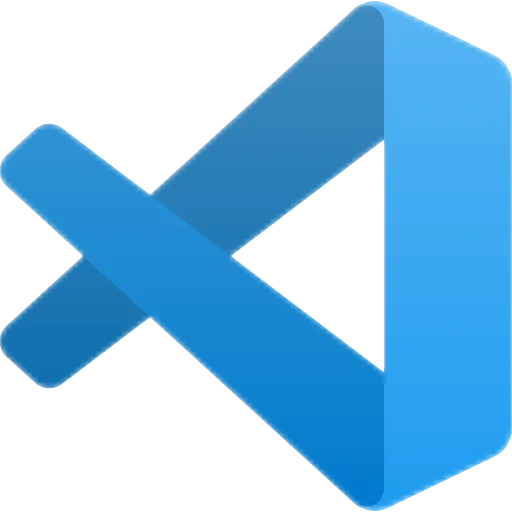

  
  <h1>Aplikasi <strong>code-server</strong></h1>
  <nav aria-label="Navigation">
    <a href="#sekilas-tentang">Sekilas Tentang</a> |
    <a href="#instalasi">Instalasi</a> |
    <a href="#konfigurasi">Konfigurasi</a> |
    <a href="#otomatisasi">Otomatisasi</a> |
    <a href="#cara-pemakaian">Cara Pemakaian</a> |
    <a href="#pembahasan">Pembahasan</a> |
    <a href="#referensi">Referensi</a>
  </nav>

## Sekilas Tentang

<strong><a href="https://github.com/coder/code-server">code-server</a></strong> adalah aplikasi web open source yang menjalankan Visual Studio Code di server, sehingga bisa diakses lewat browser dari perangkat apa pun (laptop, tablet, atau Chromebook) tanpa menginstal VS Code di sisi klien. Proyek ini dikembangkan oleh <strong><a href="https://github.com/coder/">Coder</a></strong>.

Seluruh proses berat seperti kompilasi, menjalankan terminal, dan debugging dijalankan di server, sedangkan browser hanya menampilkan antarmukanya. Karena itu lingkungan pengembangan menjadi seragam dan terpusat. Spesifikasi perangkat klien juga tidak terlalu berpengaruh, selama server cukup kuat.

## Instalasi

- Prasyarat, apa saja yang harus diinstal sebelumnya.
- Langkah instalasi dalam CLI.

## Konfigurasi (opsional)

Setting server tambahan yang diperlukan untuk meningkatkan fungsi dan kinerja aplikasi, misalnya:
- batas upload file
- batas memori
- dll

Plugin untuk fungsi tambahan
- login dengan Google/Facebook
- editor Markdown
- dll

##  Maintenance (opsional)

Setting tambahan untuk maintenance secara periodik, misalnya:
- buat backup database tiap pekan
- hapus direktori sampah tiap hari
- dll

## Otomatisasi (opsional)

Skrip shell untuk otomatisasi instalasi, konfigurasi, dan maintenance.

## Cara Pemakaian

- Tampilan aplikasi web
- Fungsi-fungsi utama
- Isi dengan data real/dummy (jangan kosongan) dan sertakan beberapa screenshot

## Pembahasan

- Pendapat anda tentang aplikasi web ini
    - kelebihan
    - kekurangan
- Bandingkan dengan aplikasi web lain yang sejenis

## Referensi

Cantumkan tiap sumber informasi yang anda pakai.
